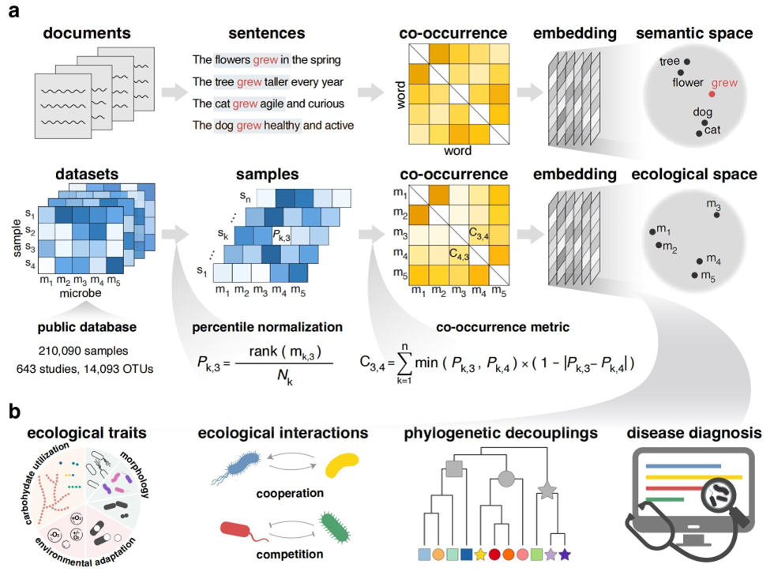

# SNEs: Microbial Social Niches Learned from >210,000 Human Gut Microbiomes for Improve Deep Learning-based Disease Classification

[](https://opensource.org/licenses/MIT) 

`membed` package adapts Natural Language Processing techniques to create Social Niche Embeddings(SNEs) for microbes based on their co-occurrence patterns across samples. These embeddings provide ecological representations of microbial taxa based on their community context.



## Human gut microbiome resource

* **Pre-training Microbiome Biom Table:** [pretraining_table_filter.biom](./data/pretraining_table_filter.biom)
  * **Description:** This BIOM-format file contains **210,090 samples** and **14,093 microbial taxa** mapped to the SILVA SSU rRNA reference, representing one of the most comprehensive human gut microbiome datasets available.
* **SNEs (100-dimensional):** [social_niche_embedding_100.txt](./data/social_niche_embedding_100.txt)
  * **Description:** This Social Niche Embedding file provides 100-dimensional vectors encoding "social niche" for all 14,093 SILVA sequences representing human gut microbes, pretrained from the BIOM table described above.


## Usage

**To reproduce our results, follow these steps to install and run the project.**

### Installation

We recommend using Conda to manage the environment and dependencies. Complete installation on a machine with 8 threads and 32GB of RAM usually takes around 45 minutes to download the repository (approx. 32GB total size) + 10 minutes for environment setup.

1. **Clone the repository:**

   ```bash
   # Clone the repository (approx. 32GB download size)
   git clone https://github.com/xu-research-lab/microbial-embeddings.git
   cd microbial-embeddings
   ```

2. **Create or Update Conda Environment:** Use the provided file to create a new, clean environment:

   ```bash
   # Create a new environment named 'membed'
   conda env create --name membed --file requirements_dev.yml
   conda activate membed
   ```

3. **Install the `membed` package:** Install in editable mode using pip (recommended for development):

   ```bash
   pip install -e .
   ```

   Alternatively, for a standard installation:

   ```bash
   pip install .
   ```

### Part 1: Generating SNEs

We adapt the **GloVe** (Global Vectors for Word Representation) model, a technique from natural language processing, to the field of microbiology. By learning from global co-occurrence statistics across more than 210,000 human gut microbiomes, the model embeds each microbe into a latent ecological space. 

- **Prerequisite:** A `biom` table (`table.biom`) containing OTU/ASV abundance data across many samples.

- **Step 1: Create a Feature Dictionary** This initial step creates a dictionary that maps each microbial feature (OTU/ASV) to a unique integer index and counts its non-zero occurrences across all samples. 

  ```bash
  membed dict -b table.biom -d feature-dict.csv
  ```

- **Step 2: Compute the Co-occurrence Matrix** A co-occurrence matrix is constructed by calculating the frequency or intensity of joint appearances for every pair of microbes across all samples.

  ```bash
  # Use the percentiled_co_abundance metric
  membed cooccur -b table.biom -c table.co --metric abundance_percentile --cpus 28
  ```

  Note: You can see all available metrics with `membed cooccur --help`. The `abundance_percentile`metric was selected as the primary method in this study. 

  + **Parameters**:
  + `-b`: **[Required]** The input path for the BIOM-format file.
    
  + `-c`: **[Required]** The output path for the co-occurrence matrix file.
    + `--metric`: Specifies the method used to quantify the association strength between microbes. Options include **binary** (presence/absence), **normalized abundance-based** (e.g., Bray-Curtis), and **percentile (rank)-based** metrics. The primary metric used in this study, `abundance_percentile`, is designed to overcome the limitations of other methods by assessing the **magnitude** of abundance for a more balanced evaluation, while also using a **percentile rank** transformation to ensure robustness against batch effects and extreme values.

- **Step 3: Calculate the `x_max` Hyperparameter **The `x_max` value is used to down-weight high-frequency co-occurrences during GloVe training, preventing them from dominating the loss function. For this purpose, the 80th percentile of the co-occurrence distribution is adopted as the threshold.

  ```bash
  membed build-x-max-file -c table.co -x xmax_file.npy --percentile_num 80
  ```

  + **Parameters**:
    + `-c`: **[Required]** The input co-occurrence matrix file generated in Step 2.
    + `-x`: **[Required]** The output path for the calculated `x_max` value, which will be saved in `.npy` format.
    + `--percentile_num`: The percentile of the co-occurrence distribution to use for calculating `x_max`. The recommended value is `80`.

- **Step 4: Train the GloVe Model to Generate Embeddings** The GloVe algorithm is trained using the co-occurrence matrix and the `x_max` value. 

  ```bash
  membed glove-train -d feature-dict.csv \
                     -c table.co \
                     -r ./result/ \
                     -x xmax_file.npy \
                     --lr 0.05 \
                     --embedding-size 100 \
                     --iter 100 \
                     --cpus 8
  ```
  
  - **Parameters**:
    - `-d`: **[Required]** The input feature dictionary file from Step 1.
    - `-c`: **[Required]** The input co-occurrence matrix file from Step 2.
    - `-x`: **[Required]** The input `x_max` file from Step 3.
    - `-r`: **[Required]** The output directory where results will be stored. The SNEs file will be saved in this directory with the name `embeddings_{embedding-size}.txt`.
    - `--lr`: Learning Rate. This hyperparameter controls the step size of weight updates during model optimization.
    - `--embedding-size`: Embedding Dimensionality. This defines the length of the vector that represents each microbe. A dimensionality of `100` was found to perform well in our study.
    - `--iter`: Number of Iterations. 
    - `--cpus`: Number of CPU Cores. 

### Part 2: Downstream Classification using SNE

The **membed class-attention** module is an attention-based classification model based on SNEs.

- **Prerequisites:**

  - Separate training, validation, and testing data (`train.biom`, `valid.biom`, `test.biom`)
  - A metadata file (`metadata.tsv`) mapping sample IDs from all three tables to their corresponding numeric class labels.
  - Pre-trained SNEs: `embeddings_100.txt`

- **Hardware Requirements:**
  - This implementation currently requires an NVIDIA CUDA GPU.
  - **Recommended:** At least 8GB VRAM for optimal performance.
  - `--numb` selects one zero-based CUDA device index.
  - Memory: At least 32GB RAM for handling large datasets. 

- **Basic Example: Training an Attention-based Classifier (as used in our paper)**

  ```bash
  membed class-attention \
      --glove-embedding result/embeddings_100.txt \
      --train-biom train.biom \
      --valid-biom valid.biom \
      --test-biom test.biom \
      --metadata metadata.tsv \
      --labels-col group \
      --sample-id-col sample_id \
      --embedding-birnn attention_loo.pt \
      --plotfile-loss attention_loss.png \
      --plotfile-auc attention_auc.png \
      --pred-out predictions \
      --num-steps 600 \
      --num-epochs 100 \
      --loss BCEWithLogits \
      --p-drop 0.4 \
      --d-ff 200 \
      --head-hidden 64 \
      --d-model 100 \
      --n-layers 1 \
      --n-heads 1 \
      --weight-decay 0.0001 \
      --lr 0.001 \
      --batch-size 64 \
      --numb 0
  ```

  Alternatively, the same model can be called directly from Python (as done in `analysis/Disease_classification_loo/run_attention_biom_with_SNEs.py`):

  ```python
  from membed.otu_attention import Attention_biom

  valid_record, test_metrics = Attention_biom(
      metadata="metadata.tsv",
      train_biom="train.biom",
      valid_biom="valid.biom",
      test_biom="test.biom",
      embedding_birnn="attention_loo.pt",
      plotfile_loss="attention_loss.png",
      plotfile_auc="attention_auc.png",
      pred_out="predictions",
      glove_embedding="result/embeddings_100.txt",
      labels_col="group",
      sample_id_col="sample_id",
      num_steps=600,
      num_epochs=100,
      loss="BCEWithLogits",
      p_drop=0.4,
      d_ff=200,
      head_hidden=64,
      d_model=100,
      n_layers=1,
      n_heads=1,
      weight_decay=0.0001,
      lr=0.001,
      batch_size=64,
      numb=0,
  )
  ```

  It returns `(valid_record, test_metrics)`: `valid_record` holds the metrics of the selected epoch, and `test_metrics` holds `auc`, `aupr`, `f1`, `mcc`, `acc`, and the confusion matrix `cm` at the frozen threshold.

  The validation table is never used for gradient updates. It selects the checkpoint and decision threshold; the test table is scored once with both choices frozen.

+ **Argument Explanation**
  + `--glove-embedding`, `--train-biom`, `--valid-biom`, `--test-biom`, `--metadata`: Specify the SNEs, three BIOM tables, and shared metadata. The metadata labels must already be numeric 0/1.
  + `--plotfile-loss`, `--plotfile-auc`, `--embedding-birnn`: Define the output paths for the training curves and selected model state. `--pred-out` writes `<prefix>_valid.csv` and `<prefix>_test.csv`.
  + `--labels-col group`: Informs the program that the column named `group` in the metadata file contains the classification labels.
  + `--num-epochs`, `--lr`, `--batch-size`, etc.: Set the model's hyperparameters, such as epochs, learning rate, batch size, and model dimensions, mirroring the definitions in your script.
  + `--select-by loss` (default) selects the checkpoint by validation loss and applies early stopping; use `membed class-attention --help` for the updated model options.
  + `--numb 0`: Selects the single CUDA device `cuda:0`.
  + `--d-model 100`: Defines the model's internal dimensionality. **This value must exactly match the dimension of the input embeddings.**

## Running the tool on test data

To test the main functionalities of the `membed` package, we provide test data and scripts in the `tests/` directory.

### Test data

The test data includes:
- `tests/data/test_Glove.biom`: A small BIOM table for testing the GloVe embedding pipeline
- `tests/data/IBD_train.biom`, `tests/data/IBD_test.biom`: Training and testing data for classification
- `tests/data/metadata_IBD.txt`: Metadata file mapping sample IDs to labels

### Running the GloVe pipeline test

To test the GloVe embedding generation pipeline:

```bash
cd tests
./run_glove.sh
```

**Expected output:** The script will generate embeddings in `tests/glove_output/` directory with detailed timing logs.

**Test results (on a machine with 32GB RAM, 8 CPU cores):**
- Total execution time: 00:04:24 (hh:mm:ss)
  - Feature dictionary: 00:00:34
  - Co-occurrence matrix: 00:01:09
  - x_max file: 00:00:04
  - GloVe training (100 iterations): 00:02:37
- Each step timing is recorded in `glove_output/pipeline_timing.log`

### Running the classification test

To test the attention-based classification module:

```bash
cd tests
./run_classification.sh
```

**Expected output:** The script will train a classification model and save results in `tests/classification_output/` directory.

**Test results (on a machine with GeForce RTX 2080Ti GPU):**
- Total execution time: 00:00:45 (hh:mm:ss)
- Timing logs are saved in `classification_output/classification_time.txt`

### Notes:
- Ensure the Conda environment is activated before running tests: `conda activate membed`
- The test scripts include time tracking to help users estimate runtime on their own hardware
- Both scripts use conservative hyperparameters suitable for testing purposes

## Code Structure & Analysis Reproducibility

This repository is organized to reproduce every analysis presented in our paper. The `analysis/` directory contains subfolders, each corresponding to a specific figure or analytical theme. Each subfolder contains its own `README.md` with detailed descriptions and reproduction instructions.

- **`resources/`**: Shared resources: scripts for building the pretraining 16S dataset and for collecting and mapping reference genomes to OTUs.
- **`sne_construction/`**: Co-occurrence metric comparison, SNE training, and embedding overview (t-SNE and tree visualizations). The reusable implementation lives in the `membed/` package; this folder retains the analysis wrappers and notebooks.
- **`synthetic_validation/`**: Validation of the SNE framework on synthetic CRM (consumer-resource model) communities (Fig. 1B-C, Extended Data Fig. 3, Supplementary Fig. S3), including data-size and embedding-dimension ablations.
- **`traits/`**: Trait analyses (Figure 2, Extended Data Fig. 5): trait annotation from BugBase, Traitar, and BacDive; PLS-DA against a phylogenetic null model; cross-database trait prediction; pretraining-size scaling.
- **`metabolic_interaction/`**: Pairwise metabolic interaction analysis (Fig. 3A-B): predicts BiGG gene profiles per OTU, builds CarveMe metabolic models, and scores pairs with SMETANA (MIP/MRO).
- **`function_phylogeny_hgt/`**: Ecological characterization of SNEs: agreement with phylogenetic distance and PICRUSt2-predicted function profiles, and prediction of horizontal gene transfer (HGT) between genome pairs.
- **`Disease_classification_loo/`**: Disease classification benchmark with leave-one-study-out / leave-one-disease-out validation: the SNE attention model vs. RF/SVM baselines, shuffled controls, alternative embeddings (phylo-PCA, DNABERT2), and model interpretation.
