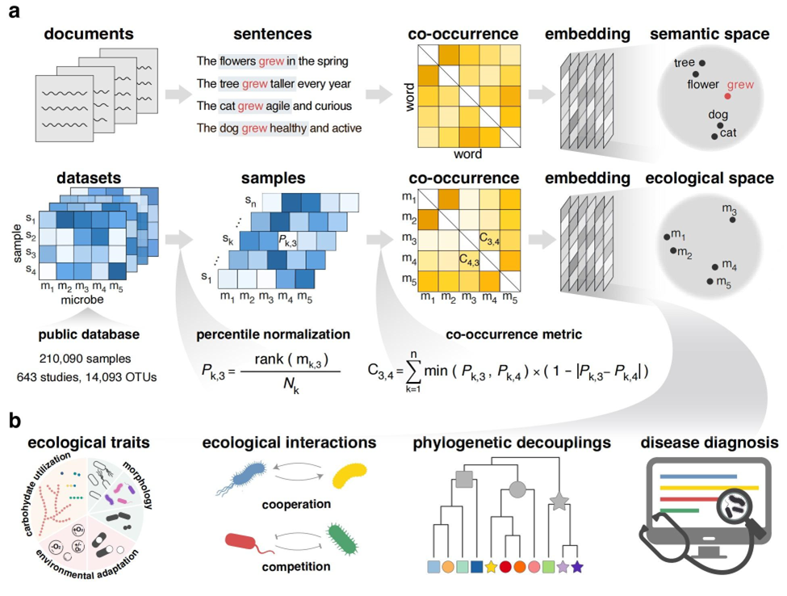

# SNEs: Microbial Social Niches Learned from >210,000 Human Gut Microbiomes for Improve Deep Learning-based Disease Classification

[](https://opensource.org/licenses/MIT)`membed` package adapts Natural Language Processing techniques to create vector representations for microbes based on their co-occurrence patterns across samples. These embeddings position microbes within a continuous ecological space to infer their social niches and functional roles.



## Download pretraining microbiome table and SNEs

- [Download pretraining microbiome table ](./data/pretraining_table_filter.biom): pretraining_table_filter.biom
- [Download social_niche_embedding](./data/social_niche_embedding_100.txt) : social_niche_embedding_100.txt

## Usage Tutorial

**To reproduce our results, follow these steps to install and run the project.**

### Installation

We highly recommend using Conda to manage the environment and dependencies.

1. **Create or Update Conda Environment:** Use the provided file to create a new, clean environment:

   ```bash
   # Create a new environment named 'membed'
   conda env create --name membed --file requirements_dev.yml
   conda activate membed
   ```

   **Install the `membed` package:** Install in editable mode using pip (recommended for development):

   ```bash
   pip install -e .
   ```

   Alternatively, for a standard installation:

   ```bash
   pip install .
   ```

### Part 1: Generating SNEs

We adapt the **GloVe** (Global Vectors for Word Representation) model, originally from the field of natural language processing, for this purpose. By learning from the global co-occurrence statistics of microbes across thousands of samples, these embedding vectors capture the "social niche" of each microbe within its complex ecological network. 

- **Prerequisite:** A `biom` table (`table.biom`) containing OTU/ASV abundance data across many samples.

- **Step 1: Create a Feature Dictionary** Before computation, it is necessary to establish a unique integer index for each microbial feature (OTU/ASV) and to count its non-zero occurrences across all samples. This dictionary serves as the foundation for identifying and processing features in all subsequent steps.

  ```bash
  membed dict -b table.biom -d feature-dict.csv
  ```

- **Step 2: Compute the Co-occurrence Matrix** This is the most critical step in generating the embeddings. A co-occurrence matrix is constructed by calculating the frequency or intensity of joint appearances for every pair of microbes across all samples.

  ```bash
  # Use the percentiled_co_abundance metric
  membed cooccur -b table.biom -c table.co --metric abundance_percentile --cpus 28
  ```

  Note: You can see all available metrics with `membed cooccur --help`. The 

  `abundance_percentile` metric is the core of our study. 

  + **Parameters**:

    + `-b`: **[Required]** The input path for the BIOM-format file.

    + `-c`: **[Required]** The output path for the co-occurrence matrix file.
    + `--metric`: The metric used to quantify the association strength between microbes. The options directly correspond to the three categories of metrics described in our paper: from **binary metrics** based on presence/absence (e.g., `russell_rao`, `jaccard`,`faith`), to **normalized abundance-based metrics** incorporating relative abundance (e.g., `braycurtis_totalsum` for Bray-Curtis and `abundance_totalsum` for co-abundance), to the **percentile (rank)-based metrics** that are the core recommendation of our study. We primarily utilized `abundance_percentile` (our percentiled co-abundance method) for its superior robustness against batch effects and extreme abundance values.

- **Step 3: Calculate the `x_max` Hyperparameter** The `x_max` value is used to down-weight high-frequency co-occurrences during GloVe training, preventing them from dominating the loss function. Our analysis identified the 80th percentile.

  ```bash
  membed build-x-max-file -c table.co -x xmax_file.npy --percentile_num 80
  ```

  + **Parameters**:
    + `-c`: **[Required]** The input co-occurrence matrix file generated in Step 2.
    + `-x`: **[Required]** The output path for the calculated `x_max` value, which will be saved in `.npy` format.
    + `--percentile_num`: The percentile of the co-occurrence distribution to use for calculating `x_max`. The recommended value is `80`.

- **Step 4: Train the GloVe Model to Generate Embeddings** The GloVe algorithm is trained using the co-occurrence matrix and the `x_max` value. 

  ```bash
  membed glove-train -d feature-dict.csv \
                     -c table.co \
                     -r ./result/ \
                     -x xmax_file.npy \
                     --lr 0.05 \
                     --embedding-size 100 \
                     --iter 100 \
                     --cpus 8
  ```
  
  - **Parameters**:
    - `-d`: **[Required]** The input feature dictionary file from Step 1.
    - `-c: **[Required]** The input co-occurrence matrix file from Step 2.
    - `-x`: **[Required]** The input `x_max` file from Step 3.
    - `-r`: **[Required]** The output directory where results will be stored. The final embeddings file will be saved in this directory with the name `embeddings_{embedding-size}.txt`.
    - `--lr`: Learning Rate. This hyperparameter controls the step size of weight updates during model optimization.
    - `--embedding-size`: Embedding Dimensionality. This defines the length of the vector that represents each microbe. Higher dimensions can capture more complex relationships but require more computational resources and may increase the risk of overfitting. A dimensionality of `100` was found to perform well in our study.
    - `--iter`: Number of Iterations. 
    - `--cpus`: Number of CPU Cores. 

### Part 2: Downstream Classification using SNE

The **membed class-attention** module is an attention-based classification model that operates on pre-trained microbial embeddings. It assigns learnable weights to each microbe within a sample to identify the key taxa most predictive of a classification target.

- **Prerequisites:**

  - Training and testing data (`train.biom`, `test.biom`)
  - A metadata file (`metadata.tsv`) mapping sample IDs to their corresponding class labels.
  - Pre-trained Embeddings: `embeddings_100.txt` \- The microbial embedding file generated in Part 1.

- **Basic Example: Training an Attention-based Classifier (as used in our paper)**

  ```bash
  membed class-attention \
      -g embedding_100.txt \
      -tra_otu train.biom \
      -tes_otu test.biom \
      -m metadata.tsv \
      --labels_col group \
      --sample_id_col sample_id \
      -e attention_loo.pt \
      -ploss attention_loss.png \
      -pauc attention_auc.png \
      --num-steps 600 \
      --num-epochs 100 \
      --loss BCE_loss \
      --p-drop 0.4 \
      --d-ff 8 \
      --d-model 100 \
      --n-layers 1 \
      --n-heads 1 \
      --weight-decay 0.0001 \
      --lr 0.0001 \
      --batch-size 512 \
      --numb 8 \
  ```

+ **Argument Explanation**
  + `-g`, `-tra_otu`, `-tes_otu`, `-m`: Specify paths to the four mandatory input files: embeddings, training BIOM, testing BIOM, and metadata, respectively.
  + `-ploss`, `-pauc`, `-e`: Define the output paths for the loss curve plot, the AUC curve plot, and the model's attention weights.
  + `--labels_col group`: Informs the program that the column named `group` in the metadata file contains the classification labels.
  + `--num-epochs`, `--lr`, `--batch-size`, etc.: Set the model's hyperparameters, such as epochs, learning rate, batch size, and model dimensions, mirroring the definitions in your script.
  + `--d-model 100`: Defines the model's internal dimensionality. **This value must exactly match the dimension of the input embeddings.**

## Code Structure & Analysis Reproducibility

This repository is organized to faithfully reproduce every analysis presented in our paper. The `analysis/` directory contains subfolders, each corresponding to a specific figure or analytical theme.

- **`Pretraining_data_profile/`**: Scripts for building and profiling the pre-training dataset
- **`Co_occurence_method/`**: Comparative Analysis of Co-occurrence Metrics 
  - Comparative_analysis.R: This is a standalone R script used to sample OTUs from a single sample and generate network visualizations for each of the 8 co-occurrence metrics. 
- **`Simulation_experiments/`**: Validation of the SNE framework using synthetic microbiome data
- **`SNE_overview/`**: Code for visualizing the pre-trained Social Niche Embeddings
- **`Genome_collection_search/`**: Scripts for mapping OTUs to reference genomes
- **`Traits/`**: Analysis of the association between SNEs and microbial traits
- **`Metabolic/`**: Metabolic interaction analysis using SMETANA
- **`HGT/`**: Analysis of SNEs in relation to phylogeny, function, and Horizontal Gene Transfer
- **`Disease_classification_loo/`**: All disease and host phenotype classification experiments


## Citation

> 

